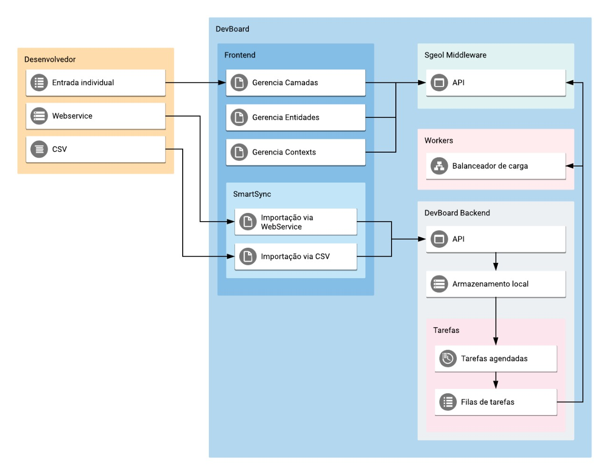

# Aqüeducte
API for consume data on format NGSI-LD

## How to use docker compose

- First of all check status and stop local mongo server (if you have):

    ``sudo systemctl status mongod``

- Stop your local mongo server

    ``sudo systemctl stop mongod``

- If want use Aqueducte without Auth, just change AUTH param from file: src/main/resources/properties.cfg

    ``AUTH = false;``

- For build a new jar file, after some change on Aqüeducte, run this command in root folder:

    ``sudo mvn clean -Dmaven.test.skip=true install``

- And, finally, for run Docker container run the command, in root folder too:

    ``sudo docker-compose up -d``

## Know more about Aqüeducte API services

http://localhost:8083/swagger-ui.html#